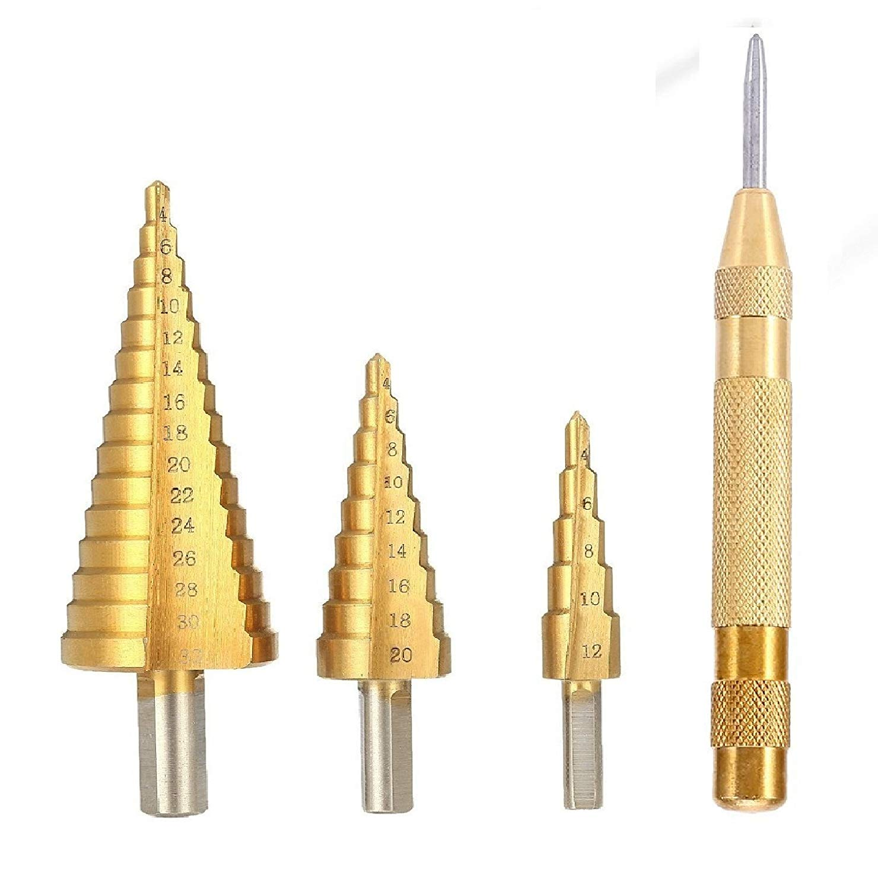

# pi-nas
a walkthrough of my Raspberry pi 4 powered network-attached storage setup
# purchase guide
## [Raspberry Pi 4 Model B 4GB variant](https://www.raspberrypi.org/products/raspberry-pi-4-model-b/?variant=raspberry-pi-4-model-b-4gb)

__Price:__ $55.00

## [Micro SD Card](https://slickdeals.net/deals/microsd/)

__Price:__ $7.49

## [Flirc Raspberry Pi 4 Case](https://flirc.tv/more/raspberry-pi-4-case)

__Price:__ $15.95

## [Seagate Backup Plus 5TB Portable Hard Drive](https://www.costco.com/Seagate-Backup-Plus-5TB-Portable-Hard-Drive-with-Rescue-Data-Recovery-Services.product.100431924.html)

__Price:__ $99.99

## [Ogrmar Plastic Dustproof IP65 Junction Box DIY Case Enclosure (6.9"x 4.9"x 3")](https://www.amazon.com/gp/product/B07872XYBX/ref=ppx_yo_dt_b_asin_title_o01_s00?ie=UTF8&psc=1)

__Price:__ $13.99

## [RJ-45 Ethernet Round Panel Mount Extension Cable - 30cm](https://www.adafruit.com/product/4215)

__Price:__ $4.95

## [USB C Round Panel Mount Extension Cable - 30cm](https://www.adafruit.com/product/4218)

__Price:__ $9.95

## [Raspberry Pi 15.3W USB-C Power Supply](https://www.raspberrypi.org/products/type-c-power-supply/)

__Price:__ $7.95
### __Total Price (NOT INCLUDING TAX + SHIPPING):__ $215.27

# Tools Needed:
* [Metric Step Bit (up to at least 30mm)](https://www.amazon.com/gp/product/B075958VBL/ref=ppx_yo_dt_b_asin_title_o00_s00?ie=UTF8&psc=1)

* A Drill
* Phillips Screwdriver

# Additional Tools Recommended:
* Automatic Center Punch
* Metric Ruler
* A Pencil